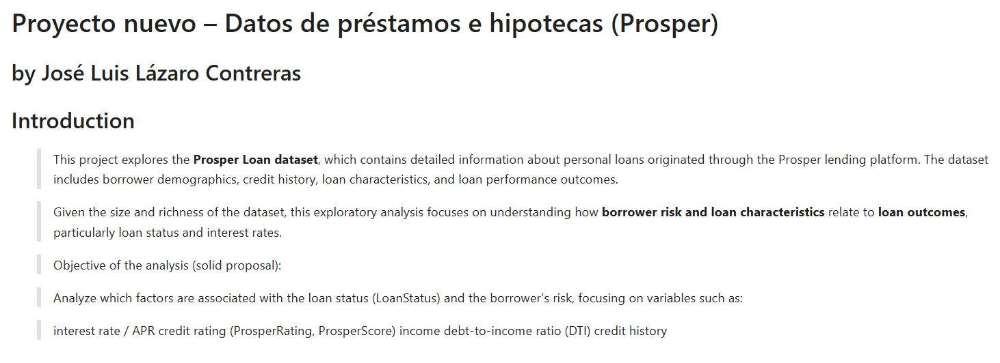
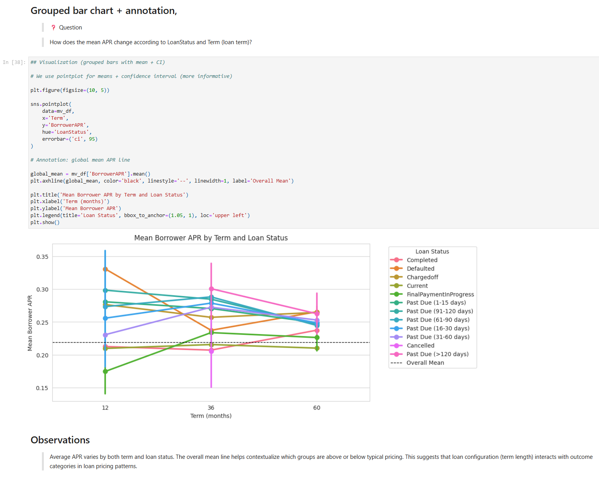
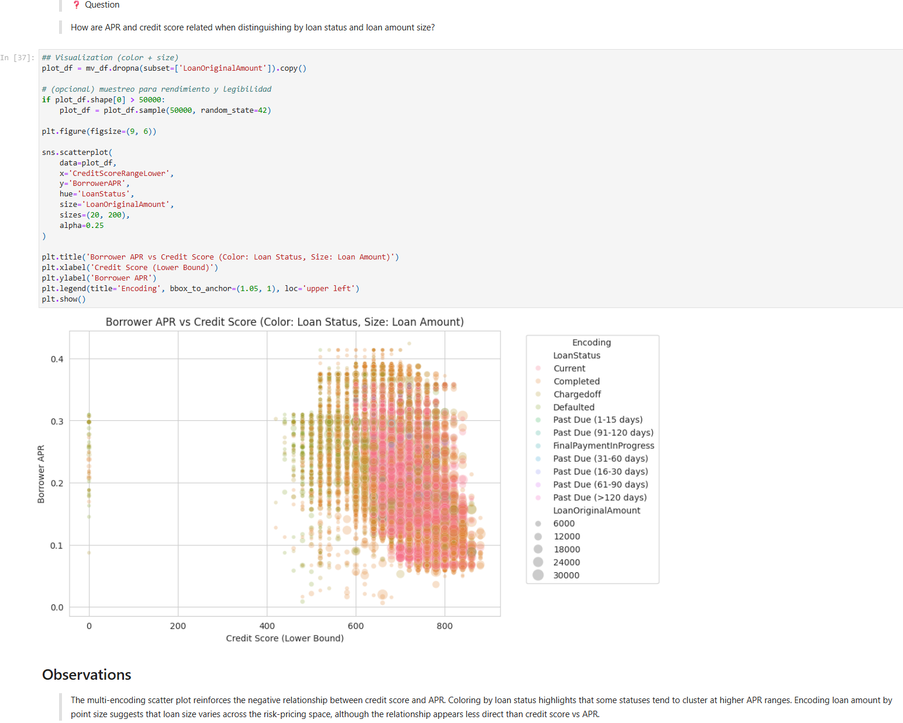

# Project Bank Credit – Risk and Loan Analysis

## Project Overview
This project analyzes a bank credit dataset to understand how **customer characteristics and loan attributes** relate to **credit risk and loan outcomes**.  
The goal is to explore which factors are associated with higher risk, higher interest rates, and unfavorable loan results.

The project follows a structured **Exploratory Data Analysis (EDA)** approach and includes:
- Part I: Exploratory Analysis
- Part II: Explanatory Analysis (presentation-style)

---

## Dataset
The dataset contains information about individual bank loans, where each row represents a single credit record.  
Key features include:

- Loan status (good / bad outcome)
- Borrower income and employment information
- Debt-to-income ratio
- Credit score or risk indicators
- Loan amount and loan term
- Interest rate / APR

The dataset is used for educational purposes as part of a data analysis project.

---

## Project Structure
The repository is organized as follows:
├── Dataset/
    ├── prosper-loan-data-variable-definitions.xlsx
    ├── prosperLoanData.csv
├── images/
│   ├── Grouped_bar_chart+annotation,.png
│   ├── Scatter_plot_with_multiple_encodings.png
    ├── Debt-to-Income_Ratio_(DebtToIncomeRatio).png 
│   └── Intro_project.png
│
├── Part_I_Bank_Credit_Exploration.ipynb
├── Part_I_Bank_Credit_Exploration.html
├── Part_II_Bank_Credit_Presentation.ipynb
├── Part_II_Bank_Credit_Presentation.html
├── README.md
└── .gitattributes

**Part I** focuses on exploring distributions and relationships in the data.
- **Part II** communicates the key insights through a concise explanatory story supported by polished visualizations.

---

## Key Questions
The analysis is guided by the following questions:

- What is the distribution of loan outcomes?
- How does borrower risk relate to interest rates?
- Which borrower characteristics are associated with higher credit risk?
- Do loans with higher interest rates tend to perform worse?

---

## Summary of Findings

- Loan outcomes are **imbalanced**, with most loans performing well and a smaller (but important) portion resulting in negative outcomes.
- **Borrower risk indicators** (such as credit score or similar proxies) are strongly associated with **higher interest rates**.
- Loans with **higher APR / interest rates** appear more frequently among loans with negative outcomes.
- Financial variables such as **debt-to-income ratio and income level** provide additional context about borrower affordability.
- Considering multiple variables together offers deeper insight than analyzing each feature in isolation.

---

## Sample Visualizations
Below are some key visualizations from the analysis:







.png)

## Methods and Tools
- Python
- pandas
- matplotlib
- seaborn
- Jupyter Notebook
- Git & GitHub

Reusable helper functions were implemented to reduce code repetition and improve readability.

---

## Explanatory Analysis (Part II)
The explanatory notebook highlights a small set of key insights:
- How borrower risk influences loan pricing
- How loan pricing relates to loan outcomes
- Why multivariate analysis provides a clearer picture of credit risk

This section is designed for a non-technical audience and focuses on storytelling through visuals.

---

## How to Run the Project
1. Clone the repository:
   ```bash
   git clone https://github.com/TU_USUARIO/project-bank-credit.git

